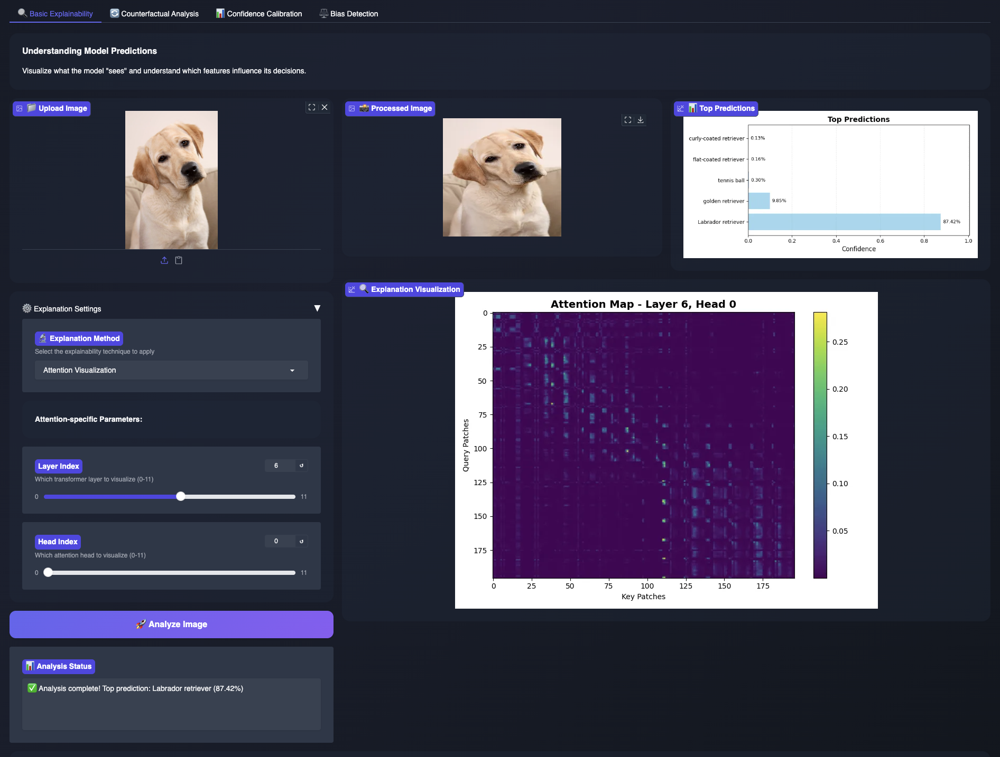
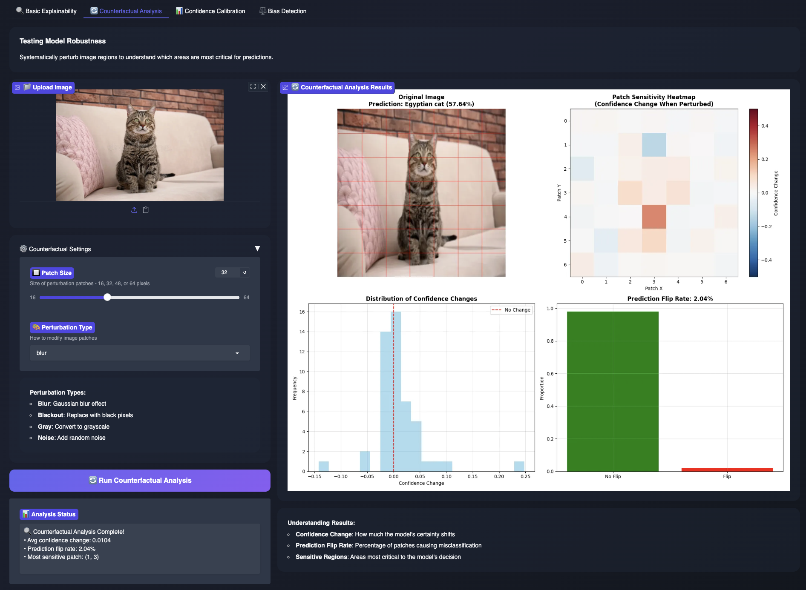
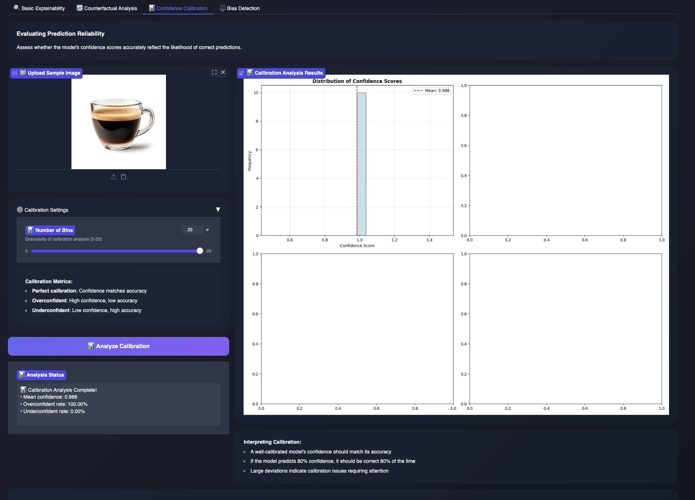
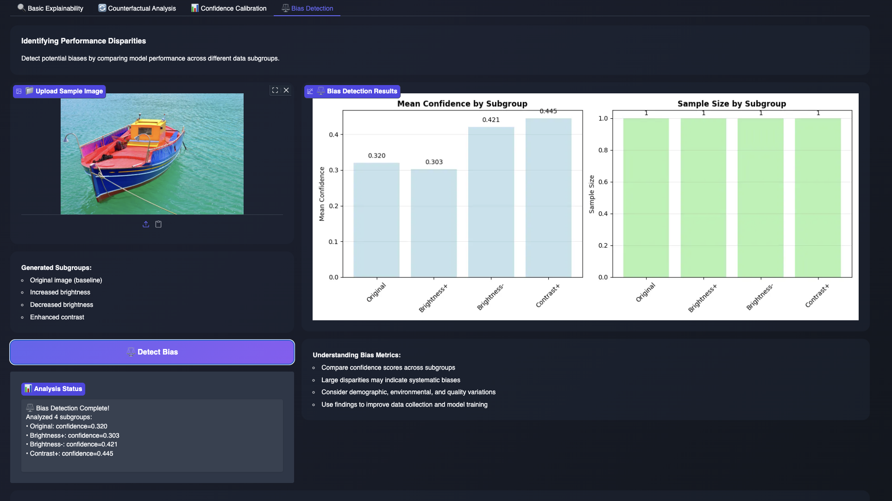

<div align="center">


**A Comprehensive Explainability and Validation Dashboard for Vision Transformers**

[🚀 Live Demo](#live-demo) | [📖 Features](#features) | [💡 Usage Guide](#usage-guide) | [🤝 Contributing](#contributing)

</div>


## 🌟 Overview

The **ViT Auditing Toolkit** is an advanced, interactive dashboard designed to help researchers, ML practitioners, and AI auditors understand, validate, and improve Vision Transformer (ViT) models. It provides a comprehensive suite of explainability techniques and auditing tools through an intuitive web interface.

### � Purpose & Scope

This toolkit is designed as an **Explainable AI (XAI) and Human-Centered AI (HCAI) analysis tool** to help you:

- **Understand model decisions** through visualization and interpretation
- **Identify potential issues** in model behavior before deployment
- **Explore model robustness** through systematic testing
- **Analyze fairness** across different data characteristics
- **Build trust** in AI systems through transparency

**Important**: This is an **exploratory and educational tool** for model analysis and research. For production-level auditing:
- Use comprehensive, representative validation datasets (not single images)
- Conduct systematic bias testing with diverse demographic groups
- Combine automated analysis with domain expert review
- Follow established AI fairness and auditing frameworks

We encourage researchers and practitioners to use this toolkit as a **starting point** for deeper investigation into model behavior, complementing it with rigorous testing protocols and domain expertise.

### �🎭 Why This Toolkit?

- **🔍 Transparency**: Understand what your ViT models actually "see" and learn
- **✅ Validation**: Verify model reliability through systematic testing
- **⚖️ Fairness**: Detect potential biases across different data subgroups  
- **🛡️ Robustness**: Test prediction stability under various perturbations
- **📊 Calibration**: Ensure confidence scores reflect true prediction accuracy

---

<a id="features"></a>
## ✨ Features

### 🔬 Basic Explainability
Visualize and understand model predictions through multiple state-of-the-art techniques:

- **🎨 Attention Visualization**: See which image patches the transformer focuses on at each layer and head
- **🔥 GradCAM**: Gradient-weighted Class Activation Mapping for highlighting discriminative regions
- **💫 GradientSHAP**: Shapley value-based attribution for pixel-level importance

### 🔄 Counterfactual Analysis
Test model robustness by systematically perturbing image regions:

- **Patch Perturbation**: Apply blur, blackout, grayscale, or noise to image patches
- **Sensitivity Mapping**: Identify which regions are critical for predictions
- **Prediction Stability**: Measure confidence changes and prediction flip rates

### 📊 Confidence Calibration
Evaluate whether model confidence scores accurately reflect prediction reliability:

- **Calibration Curves**: Visual assessment of confidence vs accuracy alignment
- **Reliability Diagrams**: Binned analysis of prediction calibration
- **Metrics Dashboard**: Mean confidence, overconfidence rate, and underconfidence rate

### ⚖️ Bias Detection
Identify performance disparities across different data subgroups:

- **Subgroup Analysis**: Compare performance across demographic or environmental variations
- **Fairness Metrics**: Detect systematic biases in model predictions
- **Comparative Visualization**: Side-by-side analysis of confidence distributions

---

<a id="live-demo"></a>
## 🚀 Live Demo

Try the toolkit instantly on Hugging Face Spaces:

### 👉 [Launch Interactive Demo](https://huggingface.co/spaces/Dyra1204/vit-auditing-toolkit)

*No installation required! Upload an image and start exploring.*

---

## �️ Test Images Included

The project includes **20 curated test images** organized by analysis type:

```bash
examples/
├── basic_explainability/    # 5 images - Clear objects for explanation testing
├── counterfactual/          # 4 images - Centered subjects for robustness testing
├── calibration/             # 3 images - Varied quality for confidence testing
├── bias_detection/          # 4 images - Different conditions for fairness testing
└── general/                 # 4 images - Miscellaneous testing
```

**Quick Download**: Run `python examples/download_samples.py` to get all test images instantly!

See [examples/README.md](examples/README.md) for detailed image descriptions and testing guidelines.

---

## �📸 Screenshots

<div align="center">

### Basic Explainability Interface


### Counterfactual Analysis


### Confidence Calibration 


### Bias Detection


</div>


---

<a id="usage-guide"></a>
## 🎯 Usage Guide

### Quick Start (3 Steps)

1. **Select a Model**: Choose between ViT-Base or ViT-Large from the dropdown
2. **Upload Your Image**: Any image you want to analyze (JPG, PNG, etc.) or use provided examples
3. **Choose Analysis Type**: Select from 4 tabs based on your needs

**💡 Tip**: Use images from the `examples/` directory for quick testing!

### Detailed Workflow

#### 🔍 For Understanding Predictions:
```
1. Go to "Basic Explainability" tab
2. Upload your image (try: examples/basic_explainability/cat_portrait.jpg)
3. Select explanation method (Attention/GradCAM/SHAP)
4. Adjust layer/head indices if needed
5. Click "Analyze Image"
6. View predictions and visual explanations
```

**Example Images to Try**:
- `cat_portrait.jpg` - Clear subject for attention visualization
- `sports_car.jpg` - Distinct features for GradCAM
- `bird_flying.jpg` - Dynamic action for SHAP analysis

#### 🔄 For Testing Robustness:
```
1. Go to "Counterfactual Analysis" tab
2. Upload your image (try: examples/counterfactual/flower.jpg)
3. Set patch size (16-64 pixels)
4. Choose perturbation type (blur/blackout/gray/noise)
5. Click "Run Analysis"
6. Review sensitivity maps and metrics
```

**Example Images to Try**:
- `face_portrait.jpg` - Test facial feature importance
- `car_side.jpg` - Identify critical vehicle components
- `flower.jpg` - Simple object for baseline testing

#### 📊 For Validating Confidence:
```
1. Go to "Confidence Calibration" tab
2. Upload a sample image (try: examples/calibration/clear_panda.jpg)
3. Adjust number of bins for analysis
4. Click "Analyze Calibration"
5. Review calibration curves and metrics
```

**Example Images to Try**:
- `clear_panda.jpg` - High-quality image (high confidence expected)
- `workspace.jpg` - Complex scene (varied confidence)
- `outdoor_scene.jpg` - Medium difficulty

#### ⚖️ For Detecting Bias:
```
1. Go to "Bias Detection" tab
2. Upload a sample image (try: examples/bias_detection/dog_daylight.jpg)
3. Click "Detect Bias"
4. Compare performance across generated subgroups
5. Review fairness metrics
```

**Example Images to Try**:
- `dog_daylight.jpg` - Test lighting variations
- `cat_indoor.jpg` - Indoor vs outdoor performance
- `urban_scene.jpg` - Environmental bias detection

---

## 💻 Local Installation

### Prerequisites

- Python 3.8 or higher
- CUDA-compatible GPU (optional, but recommended for faster inference)
- 8GB+ RAM

### Step 1: Clone the Repository

```bash
git clone https://github.com/dyra-12/ViT-XAI-Dashboard.git
cd ViT-XAI-Dashboard
```

### Step 2: Create Virtual Environment (Recommended)

```bash
# Using venv
python -m venv venv
source venv/bin/activate  # On Windows: venv\Scripts\activate

# OR using conda
conda create -n vit-audit python=3.10
conda activate vit-audit
```

### Step 3: Install Dependencies

```bash
pip install -r requirements.txt
```

### Step 4: Download Test Images (Optional but Recommended)

```bash
# Download 20 curated test images for all tabs
python examples/download_samples.py

# Or use the bash script
chmod +x examples/download_samples.sh
./examples/download_samples.sh
```

This creates an `examples/` directory with images organized by tab.

### Step 5: Run the Application

```bash
python app.py
```

The dashboard will be available at `http://localhost:7860`

### 🐳 Docker Installation (Alternative)

```bash
# Build the Docker image
docker build -t vit-auditing-toolkit .

# Run the container
docker run -p 7860:7860 vit-auditing-toolkit
```

---

## 🏗️ Project Structure

```
ViT-XAI-Dashboard/
│
├── app.py                      # Main Gradio application
├── requirements.txt            # Python dependencies
├── README.md                   # This file
├── examples/download_samples.py         # Script to download test images
│
├── src/
│   ├── __init__.py
│   ├── model_loader.py         # ViT model loading from Hugging Face
│   ├── predictor.py            # Prediction and classification logic
│   ├── explainer.py            # XAI methods (Attention, GradCAM, SHAP)
│   ├── auditor.py              # Advanced auditing tools
│   └── utils.py                # Helper functions and preprocessing
│
├── examples/                   # 20 curated test images
│   ├── basic_explainability/   # Images for Tab 1 testing
│   ├── counterfactual/         # Images for Tab 2 testing
│   ├── calibration/            # Images for Tab 3 testing
│   ├── bias_detection/         # Images for Tab 4 testing
│   └── general/                # General purpose test images
│
└── tests/
    ├── test_phase1_complete.py # Basic functionality tests
    └── test_advanced_features.py # Advanced auditing tests
```

---

## 🧠 Technical Details

### Vision Transformers (ViT)

Vision Transformers apply the transformer architecture (originally designed for NLP) to computer vision tasks. Key concepts:

- **Patch Embedding**: Images are split into fixed-size patches (e.g., 16×16 pixels)
- **Self-Attention**: Each patch attends to all other patches to capture global context
- **Layer Hierarchy**: Multiple transformer layers progressively refine representations
- **Classification Token**: A special [CLS] token aggregates information for final prediction

**Advantages:**
- Strong performance on large-scale datasets
- Captures long-range dependencies better than CNNs
- More interpretable through attention mechanisms

### Explainability Techniques

#### 1. Attention Visualization
**Method**: Direct visualization of transformer attention weights  
**Purpose**: Shows which image patches the model focuses on  
**Implementation**: Extracts attention matrices from specified layers/heads

```python
# Example: Layer 6, Head 0 typically captures semantic patterns
attention_map = model.encoder.layer[6].attention.self.attention_weights
```

#### 2. GradCAM (Gradient-weighted Class Activation Mapping)
**Method**: Uses gradients flowing into the final conv layer  
**Purpose**: Highlights discriminative regions for target class  
**Implementation**: Via Captum's `LayerGradCam`

```python
# Generates heatmap showing which regions support the prediction
gradcam = LayerGradCam(model, target_layer)
attribution = gradcam.attribute(input, target=predicted_class)
```

#### 3. GradientSHAP (Gradient-based Shapley Values)
**Method**: Combines Shapley values with gradient information  
**Purpose**: Pixel-level attribution with theoretical guarantees  
**Implementation**: Via Captum's `GradientShap`

```python
# Computes fair attribution using random baselines
gradient_shap = GradientShap(model)
attributions = gradient_shap.attribute(input, baselines=random_baselines)
```

### Auditing Methodologies

#### Counterfactual Analysis
Systematically modifies image regions to test:
- **Robustness**: Does the prediction remain stable?
- **Feature Importance**: Which regions matter most?
- **Adversarial Vulnerability**: How easy is it to fool the model?

#### Confidence Calibration
Measures alignment between predicted confidence and actual accuracy:
- **Well-calibrated**: 80% confidence → 80% correct
- **Overconfident**: 90% confidence → 60% correct (problem!)
- **Underconfident**: 50% confidence → 80% correct (less critical)

#### Bias Detection
Compares performance across subgroups to identify:
- **Demographic bias**: Different accuracy for different groups
- **Environmental bias**: Performance varies with lighting, quality, etc.
- **Systematic patterns**: Consistent over/under-performance

---

### 🔧 Supported Models

The dashboard now supports multiple architectures (ViT family and others). The models currently exposed in the UI are:

| Display name | Hugging Face ID | Notes |
|--------------:|-----------------|-------|
| ViT-Base | `google/vit-base-patch16-224` | ViT — attention visualizations and GradCAM supported |
| ViT-Large | `google/vit-large-patch16-224` | ViT — attention visualizations and GradCAM supported |
| ResNet-50 | `microsoft/resnet-50` | CNN — GradCAM supported; attention visualization not applicable |
| Swin Transformer | `microsoft/swin-base-patch4-window7-224` | Swin — GradCAM supported; attention visualization limited to ViT-style models |
| DeiT | `facebook/deit-base-patch16-224` | ViT-like — attention visualizations and GradCAM supported |
| EfficientNet-B7 | `google/efficientnet-b7` | CNN — loaded via Hugging Face when possible; if HF loading triggers a torch.load restriction, the app falls back to `timm` (no torch upgrade required). GradCAM supported; attention visualization not applicable |

Notes:
- Attention visualizations (patch-level attention maps) are meaningful for ViT-style models (ViT, DeiT). For CNNs (ResNet, EfficientNet) and some hierarchical transformers (Swin), the dashboard will use GradCAM or a last-conv fallback instead of patch attention.
- EfficientNet on the Hugging Face hub can trigger a torch.load security restriction in older torch versions. The toolkit will transparently fall back to a `timm`-based loader to avoid requiring a torch upgrade; this is handled automatically in `src/model_loader.py`.

**Easy to extend**: Add more models to `src/model_loader.py` under `SUPPORTED_MODELS` and they will appear in the app dropdown.

---

## 📦 Dependencies

### Core Libraries

- **PyTorch** (≥2.2.0): Deep learning framework
- **Transformers** (≥4.35.0): Hugging Face model hub
- **Gradio** (≥4.19.0): Web interface framework
- **Captum** (≥0.7.0): Model interpretability library

### Supporting Libraries

- **Pillow**: Image processing
- **Matplotlib**: Visualization
- **NumPy**: Numerical computations

See `requirements.txt` for complete list with version constraints.

---

## 🎓 Use Cases

### Research
- **Interpretability Studies**: Analyze transformer attention patterns
- **Benchmark Explainability**: Compare XAI methods systematically
- **Model Auditing**: Validate models before deployment

### Industry
- **Model Validation**: Ensure reliability before production
- **Bias Auditing**: Detect and mitigate fairness issues
- **Regulatory Compliance**: Document model decision-making

### Education
- **Teaching Tool**: Demonstrate XAI concepts interactively
- **Student Projects**: Foundation for ML course assignments
- **Research Training**: Hands-on experience with modern techniques

---

<a id="contributing"></a>
## 🤝 Contributing

Contributions are welcome! Here's how you can help:

### Ways to Contribute

1. **🐛 Bug Reports**: Open an issue with detailed reproduction steps
2. **✨ Feature Requests**: Suggest new explainability methods or auditing tools
3. **📝 Documentation**: Improve guides, add examples, fix typos
4. **💻 Code**: Submit pull requests for new features or fixes
5. **🎨 UI/UX**: Enhance the dashboard design and user experience

### Development Setup

```bash
# Fork and clone the repository
git clone https://github.com/YOUR-USERNAME/ViT-XAI-Dashboard.git
cd ViT-XAI-Dashboard

# Create a feature branch
git checkout -b feature/your-feature-name

# Make changes and test
python -m pytest tests/

# Commit and push
git commit -m "Add: your feature description"
git push origin feature/your-feature-name

# Open a pull request
```

### Code Style
- Follow PEP 8 guidelines
- Add docstrings to all functions
- Include type hints where applicable
- Write unit tests for new features

---

## � Additional Resources

- **[QUICKSTART.md](QUICKSTART.md)** - Get started in 5 minutes
- **[TESTING.md](TESTING.md)** - Comprehensive testing guide with 22 test cases
- **[CONTRIBUTING.md](CONTRIBUTING.md)** - Guidelines for contributors
- **[CHEATSHEET.md](CHEATSHEET.md)** - Quick reference for common tasks
- **[examples/README.md](examples/README.md)** - Detailed test image guide

---

## �📄 License

This project is licensed under the **MIT License** - see the [LICENSE](LICENSE) file for details.

```
MIT License

Copyright (c) 2024 ViT Auditing Toolkit Contributors

Permission is hereby granted, free of charge, to any person obtaining a copy
of this software and associated documentation files (the "Software"), to deal
in the Software without restriction, including without limitation the rights
to use, copy, modify, merge, publish, distribute, sublicense, and/or sell
copies of the Software, and to permit persons to whom the Software is
furnished to do so, subject to the following conditions:

[Full license text...]
```

---

##  Contact & Support

- **GitHub Issues**: [Report bugs or request features](https://github.com/dyra-12/ViT-XAI-Dashboard/issues)
- **Discussions**: [Ask questions or share ideas](https://github.com/dyra-12/ViT-XAI-Dashboard/discussions)
- **Email**: dyra12@example.com

---

<div align="center">

**Built with ❤️ by the community**

[⬆ Back to Top](#-vit-auditing-toolkit)

</div>
